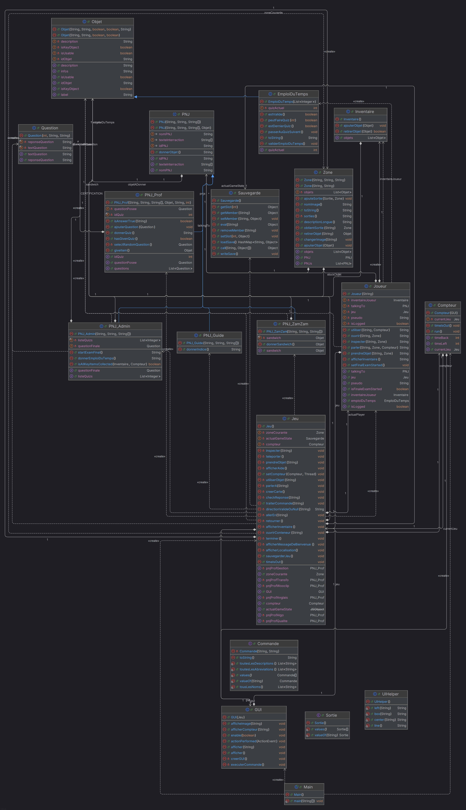

# TheMiagiste03Game

Un jeu d'aventure développé par une équipe d'étudiants passionnés dans le cadre du projet de fin d'année de la Licence 3 MIAGE de l'Université d'Aix-Marseille.

## 🎮 À propos du jeu

TheMiagiste03Game est un jeu d'aventure textuel où vous incarnez un étudiant en MIAGE. Votre mission : réussir votre année universitaire en gérant votre emploi du temps, en interagissant avec vos professeurs et en résolvant des énigmes. Attention au ZAM ZAM qui pourrait vous distraire de vos objectifs !

## 👥 Équipe de développement

- **Amine AMAR**
- **Amine FOUFA**
- **Baptiste NOTO**

## 🛠️ Technologies utilisées

- Java
- JUnit pour les tests
- Documentation Javadoc

## 📁 Structure du projet

```
src/
├── jeu/           # Code source principal du jeu
│   ├── PNJ/       # Classes des personnages non-joueurs
│   ├── Objet.java # Système d'objets du jeu
│   └── ...
└── test/          # Tests unitaires
    └── jeu/       # Tests des composants du jeu
```

## 🚀 Comment commencer

1. Clonez le dépôt :
```bash
git clone https://github.com/Lenc3lot/TheMiagiste03Game.git
```

2. Compilez le projet :
```bash
javac src/jeu/*.java
```

3. Lancez le jeu :
```bash
java -cp src jeu.Main
```

## 🧪 Tests

Les tests unitaires peuvent être exécutés avec JUnit :
```bash
java -jar junit-platform-console-standalone-1.7.0.jar --class-path src --scan-class-path
```

## 📚 Documentation

La documentation Javadoc est disponible dans le dossier `doc/`. Pour la générer :
```bash
javadoc -d doc src/jeu/*.java
```

## 📊 Diagramme UML

Le diagramme UML du projet est disponible ci-dessous :



Ce diagramme représente la structure des classes principales du jeu et leurs relations. Il inclut :
- Les classes de base (Objet, Zone, PNJ)
- Les différentes sous-classes de PNJ (Admin, Prof, Guide, ZamZam)
- Les relations entre les classes
- Les attributs et méthodes principales